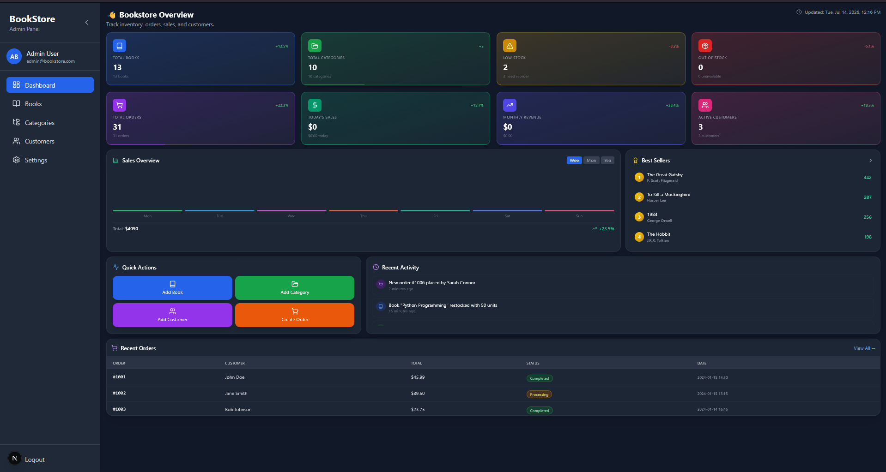
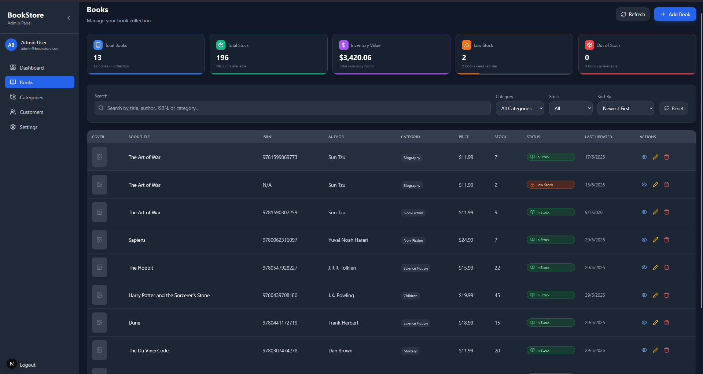
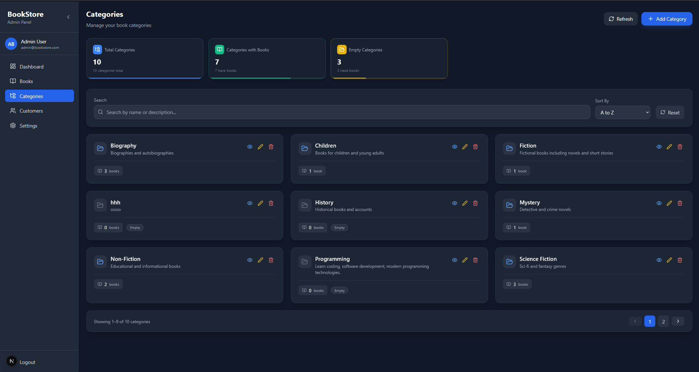
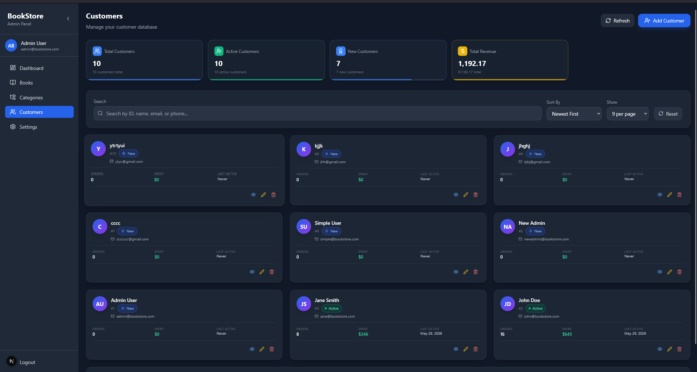
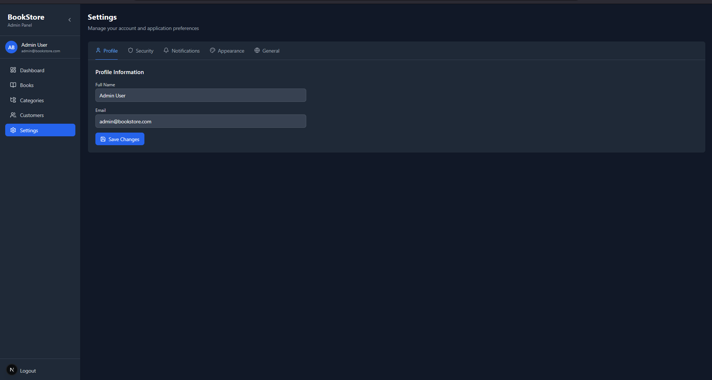

# 📚 Bookstore Management System

A modern, responsive **Bookstore Management System** built with **Next.js**, **TypeScript**, and **Tailwind CSS**. The application provides an intuitive admin dashboard for managing books, inventory, categories, customers, and store operations through a clean and user-friendly interface.

---

## 🚀 Features

### 📊 Dashboard
- Real-time overview of bookstore statistics
- Total books, categories, customers, and low-stock alerts
- Quick access to key business metrics

### 📚 Book Management
- Add new books
- Update existing book information
- Soft delete books
- Search books instantly
- Pagination for efficient browsing
- Stock status indicators
- Bulk selection support

### 📦 Inventory Management
- Monitor stock levels
- Low-stock notifications
- Inventory status tracking
- Quantity management

### 🗂 Category Management
- Create categories
- Update categories
- Delete categories
- Organize books by category

### 🔍 Search
- Fast search by title or author
- Responsive search interface

### 🎨 Modern User Interface
- Professional dashboard layout
- Responsive sidebar navigation
- Interactive data tables
- Responsive design for desktop, tablet, and mobile devices
- Clean typography and smooth animations

---

## 🛠 Tech Stack

| Technology | Purpose |
|------------|---------|
| Next.js 16 | React Framework |
| TypeScript | Type Safety |
| Tailwind CSS | Styling |
| Lucide React | Icons |
| App Router | Routing |
| Geist Font | Typography |

---

## 📁 Project Structure

```text
bookstoreManagement/
│
├── app/
├── components/
├── lib/
├── public/
├── styles/
├── package.json
└── README.md
```

---

## ⚙️ Installation

Clone the repository

```bash
git clone https://github.com/Chan420-cyber/bookstoreManagement.git
```

Navigate to the project

```bash
cd bookstoreManagement
```

Install dependencies

```bash
npm install
```

Run the development server

```bash
npm run dev
```

Open your browser and visit

```
http://localhost:3000
```

---

## 📸 Screenshots

### Dashboard



### Books Management



### Categories



### Customers



<!-- ### Settings

 -->

---

## 🎯 Current Features

- ✅ Dashboard
- ✅ Books Management
- ✅ Inventory Management
- ✅ Category Management
- ✅ Search Functionality
- ✅ Pagination
- ✅ Responsive Design
- ✅ CRUD Operations
- ✅ Soft Delete

---

## 💡 Project Goals

This project was developed to strengthen full-stack web development skills by building a practical management system that demonstrates:

- Clean and scalable architecture
- Responsive UI development
- CRUD functionality
- State management
- Component-based design
- Professional dashboard development
- Real-world business workflow implementation

---

## 🤝 Contributing

Contributions, suggestions, and feedback are welcome.

1. Fork the repository
2. Create a feature branch
3. Commit your changes
4. Push your branch
5. Open a Pull Request

---

## 📄 License

This project is available for educational and portfolio purposes.

---

## 👨‍💻 Author

**Chan**

GitHub: https://github.com/Chan420-cyber